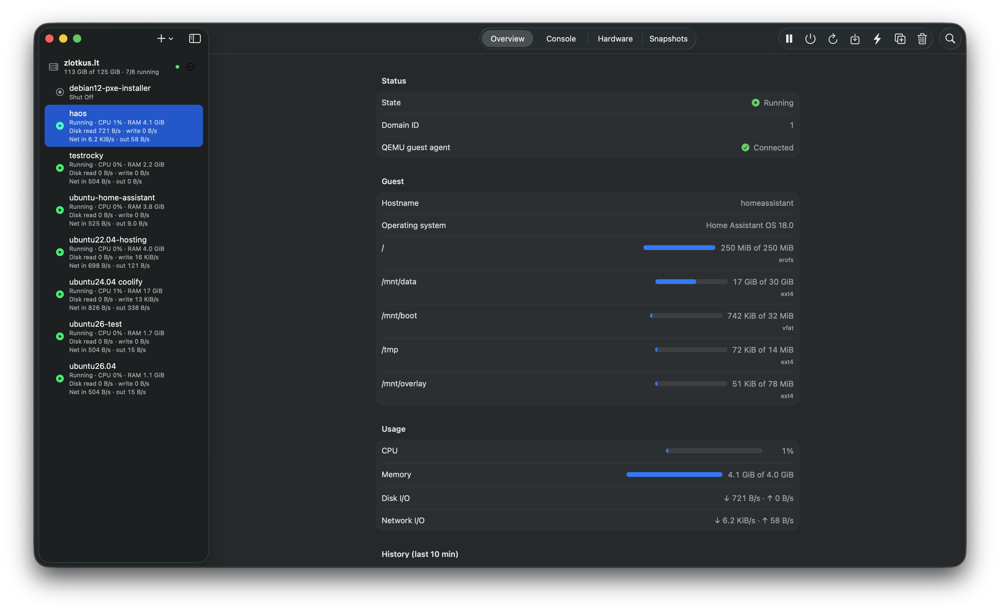
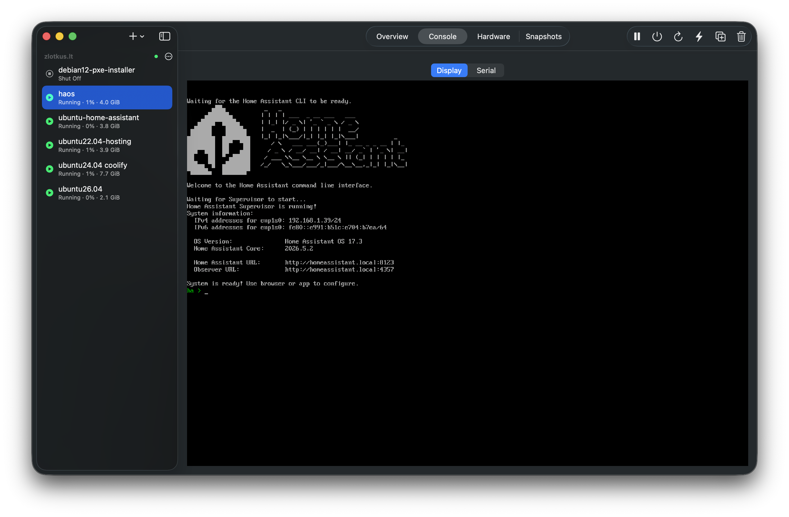
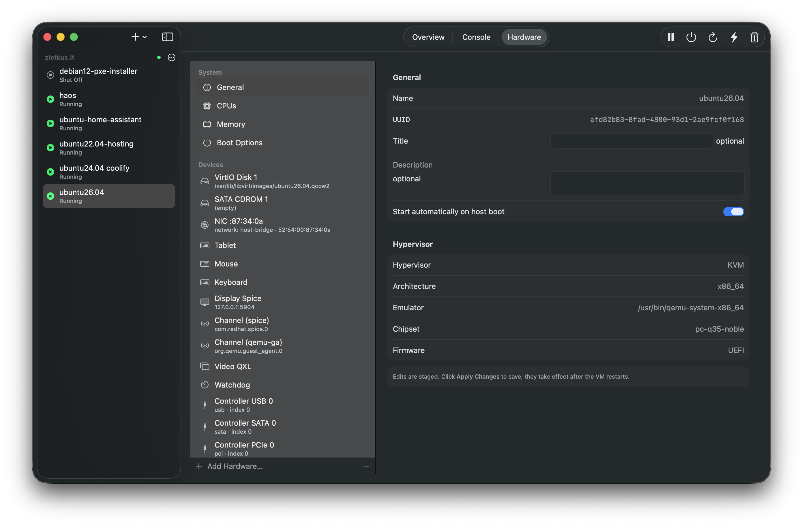
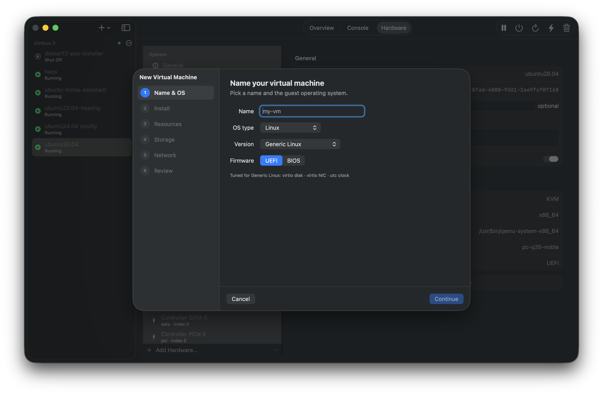
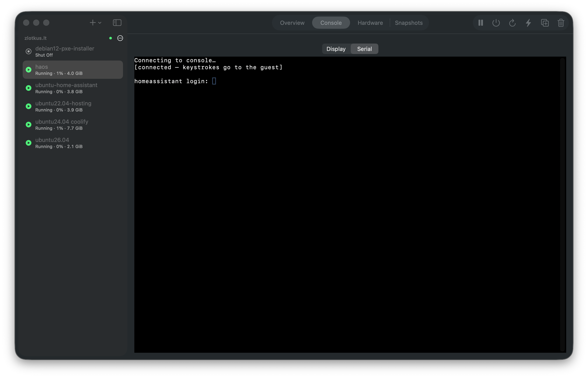
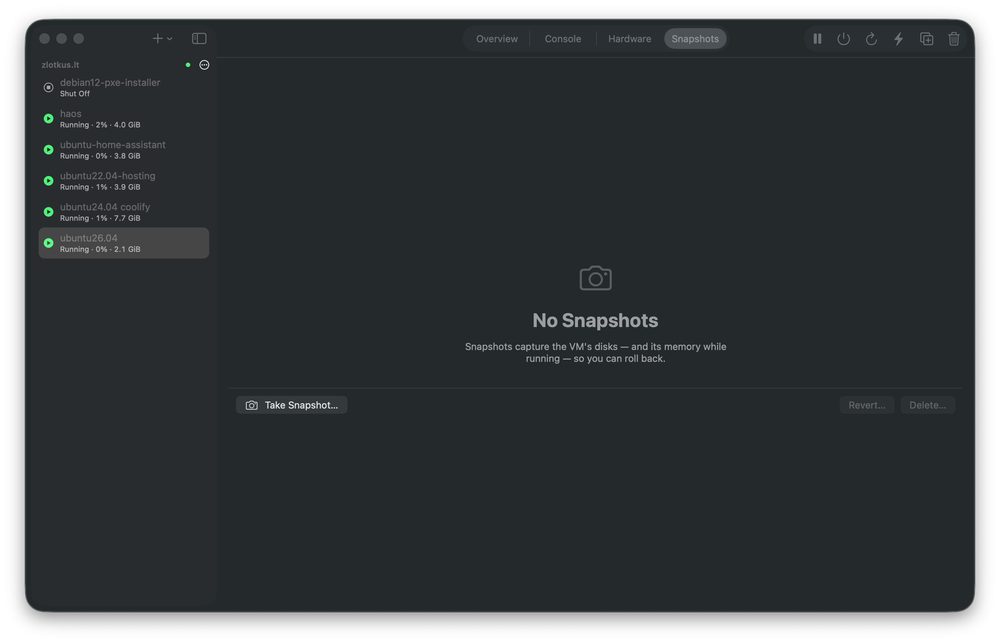

# Virt Manager Modern

A **native macOS app for managing remote QEMU/KVM servers over libvirt** — a
Mac-native alternative to the GTK [virt-manager](https://virt-manager.org).
Connect over `qemu+ssh`, browse your VMs with live state, create and delete
machines, edit their hardware with real forms (no XML), and open SPICE or VNC
consoles rendered natively in the window.



| Console (SPICE, SSH-tunnelled) | Hardware manager | New VM wizard |
|---|---|---|
|  |  |  |

| Serial console (headless VMs) | Snapshots |
|---|---|
|  |  |

## Why

Running the original virt-manager on macOS is a rough ride: it's a GTK app
glued on with Homebrew, so you get non-native menus and shortcuts, blurry
HiDPI rendering, sluggish remote consoles, and a dependency stack that breaks
on the next `brew upgrade`. It works — barely — but it never feels like a Mac
app, because it isn't one.

This project is that itch, scratched: a from-scratch SwiftUI client for the
same libvirt/QEMU hosts, with consoles, hardware editing, snapshots, and
storage handled natively.

### Compared to original virt-manager

**Where this app is better on a Mac:**

- Native SwiftUI app — real macOS toolbar, shortcuts, trackpad, Retina
  rendering; no GTK/XQuartz anywhere in the stack.
- Self-contained `.app`: every library is built from pinned upstream sources
  and bundled. No Homebrew at runtime, nothing to break on a system update.
- SSH tunnels for SPICE/VNC are created automatically per console.
- Quality-of-life extras virt-manager lacks: **ISO upload from your Mac** over
  libvirt streams (no scp), guest IPs with one-click copy, live CPU/memory
  stats in the VM list, VM search/filter, keyboard shortcuts for lifecycle
  actions, guard rails in hardware editing (controllers in use can't be
  removed, duplicate singletons can't be added), automatic installer ISO eject
  on power actions, host dashboard with live memory stats, storage/network
  managers, managed save, and VM screenshots.

**Where original virt-manager still wins:**

- Maturity: ~20 years of edge cases; this app is young.
- Breadth: migration between hosts, multiple hypervisor drivers (Xen, LXC, …),
  unattended installs backed by the full libosinfo database (this app ships a
  curated OS catalog and is QEMU/KVM + single-host focused).
- Cross-platform and packaged by every Linux distribution; this app is
  macOS-14+/Apple-Silicon only.

## About this project

This entire application — the Swift/SwiftUI code, the C interop shims for
libvirt and spice-gtk, the from-source dependency build system, the docs, and
the screenshots — was built end-to-end by **Anthropic's Claude (Fable 5)**
working as a coding agent, in conversation with a human who steered, tested
against real hardware, and reviewed. It stands as a demonstration of what
current Claude models can build autonomously: a working native client speaking
a 20-year-old C virtualization API, with its own reproducible toolchain.

## Features

- **Connections** to remote libvirt over `qemu+ssh://` (SSH keys / ssh-agent),
  managed in a virt-manager-style add/edit dialog with autoconnect.
- **VM list** in a native sidebar with live status, plus full lifecycle:
  start, graceful shutdown, reboot, force off, pause/resume, **managed save**
  (hibernate to disk with Restore on next start).
- **New VM wizard** with a guest-OS catalog (the role libosinfo plays in legacy
  virt-manager): picking e.g. *Ubuntu 24.04* or *Windows 11* pre-fills
  recommended CPU/RAM/disk and tunes devices — virtio vs SATA/e1000e, Hyper-V
  enlightenments + localtime clock for Windows, TPM 2.0 + forced UEFI for
  Windows 11.
- **Hardware manager**: schema-driven forms for ~20 device types (disks,
  NICs, graphics, controllers, host USB/PCI passthrough, TPM, …) with host-
  populated pickers (virtual networks, storage volumes, node devices).
  **Add Hardware** knows what's addable (singleton devices, SPICE-dependent
  devices); **Remove** knows what's removable (controllers in use are blocked,
  removing the boot disk warns). Edits stage into a working copy and apply via
  `defineXML`. **Config drift** detection when the running VM differs from
  the saved definition — diff sheet, **revert running to saved** for hot-plug
  changes, and warnings before shutdown/reboot/save/force-off.
- **Delete VM** flow with per-file storage cleanup checkboxes, force-off for
  running VMs, and full metadata cleanup (UEFI NVRAM, managed save, snapshots).
- **SPICE and VNC consoles**, both tunnelled automatically over SSH and
  rendered natively (no GTK). Detach to a separate window with fullscreen.
  **Clipboard sharing** for SPICE (UTF-8) and VNC (RoyalVNCKit redirection),
  **SPICE audio**, **USB redirection** with a device picker in the console
  toolbar, and a **multi-monitor picker** when the guest exposes more than one
  display — all toggled in **Settings** (⌘,). The Console tab picks the right
  protocol from the VM's `<graphics>` device — and falls back to a real **serial
  console** (terminal emulator over `virDomainOpenConsole`) for headless VMs.
  CD-ROM media can be ejected live; power actions auto-eject installers so they
  don't boot again.
- **Live stats & guest IPs**: CPU%, memory, aggregate block/disk and network
  I/O, and **per-device disk & NIC throughput** per running VM in the sidebar
  and Overview (event-driven VM list, stats polled every 5s); guest IP
  addresses (guest agent or DHCP leases) with one-click copy; QEMU guest agent
  status badge on Overview.
- **VM screenshots** on the Overview tab (`virDomainScreenshot`), auto-refresh
  every 30s while running, with Save to disk.
- **Host dashboard**: per-connection host info (CPU model, installed memory,
  **live memory use**, VM counts, libvirt version) from the connection menu.
- **Storage pool manager**: start/stop/rescan pools; **create**, **resize**,
  **wipe**, and delete volumes; lists refresh on libvirt storage-pool events.
- **Virtual network manager**: list/start/stop/delete networks; **XML editor**
  for custom definitions; one-click default NAT network setup.
- **Snapshots**: create (incl. memory while running), revert, delete — shown
  as a tree with the current marker.
- **Clone VM** with per-disk Clone/Share/Skip, and **ISO upload** from the Mac
  straight into a host storage pool (libvirt streams — no scp).
- **Live hotplug**: attach disks/NICs/USB devices to running VMs, detach them
  live, and resize vCPUs/memory without a restart.
- **Preferences** (⌘,): default detail tab, SPICE/VNC clipboard, SPICE audio,
  and USB redirection toggles.

## Requirements

- **macOS 14+ on Apple Silicon**
- **Xcode Command Line Tools** (`xcode-select --install`) and network access —
  *nothing else*: no Homebrew, no pre-installed libraries
- A libvirt/QEMU host reachable over SSH (key/agent auth) — or none at all if
  you just want to poke the UI (`make run-dev` includes libvirt's built-in
  `test:///default` driver)

## Build & run

```sh
git clone <this repo> && cd virt-manager-modern
make            # first run builds all C dependencies from source (~10 min), then the app
make run        # open VirtManagerModern.app
make run-dev    # same + built-in test driver (no server needed)
swift test      # unit tests
```

Every C dependency (libvirt, glib, spice-client-glib, OpenSSL, gnutls,
gstreamer, …) is compiled from **pinned upstream release tarballs** into
`third_party/` and embedded into the `.app`, which therefore runs on any
Apple Silicon Mac without dependencies. See [docs/BUILDING.md](docs/BUILDING.md)
for the details (and for bumping dependency versions).

### Distribution (Developer ID + notarization)

Local builds are **ad-hoc signed** (`make` / `make app`). For a Gatekeeper-
friendly release zip, use the signing script once you have an Apple Developer
account, a **Developer ID Application** certificate, and notary credentials:

```sh
# One-time: store notary credentials (or set NOTARY_API_KEY / _KEY_ID / _ISSUER_ID)
xcrun notarytool store-credentials AC_NOTARY \
  --apple-id YOU@EMAIL --team-id TEAMID --password APP-SPECIFIC-PASSWORD

make sign       # Developer ID sign + verify (no notarization)
make release    # sign → notarize → staple → dist/VirtManagerModern-<version>.zip
```

Bundle ID: `com.muanton.virtmanagermodern`. App version is in `VERSION` (synced
into the bundle on `make app`; bump with `make bump-patch` / `bump-minor` /
`bump-major` — see [CONTRIBUTING.md](CONTRIBUTING.md#versioning)). See
`Scripts/sign-and-notarize.sh` for environment overrides and `--sign-only` usage.

## Architecture

| Module | Responsibility |
|---|---|
| `CLibvirt` / `CSpice` | System-library modules mapping the self-built libvirt / spice-client-glib headers via pkg-config. |
| `LibvirtKit` | Swift wrappers over libvirt: connections, domain state, lifecycle, XML, storage, node devices. Blocking calls serialized off-main, exposed as `async`. |
| `DomainModel` | Parses/edits libvirt domain XML into typed values: device schemas, add/remove rules, guest-OS catalog, New VM template. |
| `ConsoleKit` | SSH port-forward tunnel + VNC session ([RoyalVNCKit]), exposing a live framebuffer `NSView`. |
| `SpiceShim` / `SpiceKit` | Small C shim hiding spice-gtk's GLib machinery (one shared GLib loop thread for all sessions) + Swift wrapper and AppKit renderer. |
| `App` | SwiftUI: sidebar, lifecycle toolbar, Overview/Console/Hardware tabs, wizards and sheets. |

## Status & limitations

- VNC and SPICE consoles (scaled-to-fit, full keyboard/mouse, detach window).
  Clipboard for both protocols (Settings to disable). SPICE audio, USB
  redirection, and multi-monitor display selection are supported; no RDP yet.
- VMs using virtio-gpu **GL scanout** (`<gl enable='yes'>`) aren't rendered —
  use a non-GL video model or an external viewer.
- Screenshots require a running VM with a graphics device; format is
  hypervisor-specific (usually PNG on QEMU/KVM).
- Local builds are **ad-hoc signed**: on another Mac, right-click → Open the
  first time. Use `make release` for a notarized build (see **Distribution**
  above); pre-built release downloads are not published yet.
- arm64 only (the dependency build targets Apple Silicon).
- Not sandboxed (spawns `ssh` for tunnels and the `qemu+ssh` transport).

## License

This project is licensed under the **GNU General Public License v2.0** — see
[LICENSE](LICENSE). There are no per-file headers; the root license governs.

The bundled third-party libraries are built from unmodified upstream sources
and dynamically linked; each keeps its own license (LGPL: libvirt, GLib,
spice-client-glib, gstreamer, gnutls, proxy-libintl, json-glib; Apache-2.0:
OpenSSL; BSD: pcre2, spice-protocol; MIT: pixman; IJG: libjpeg; LGPL/GPL
dual: gmp, nettle). [RoyalVNCKit] is MIT-licensed.

[RoyalVNCKit]: https://github.com/royalapplications/royalvnc